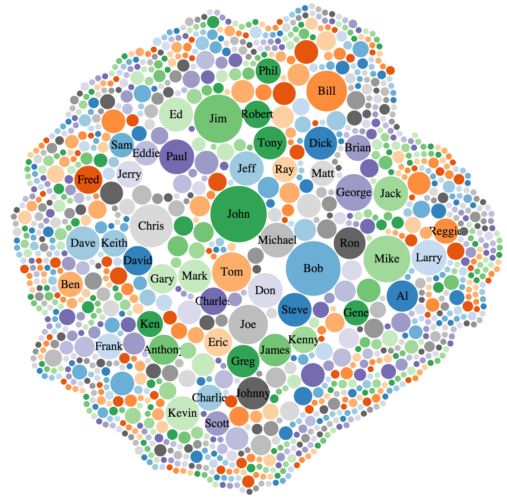

# NBA Stats

Ever wondered what the most popular names of NBA players are?

## Name Stats


## Installation & running this yourself
After you have cloned this repo you can:

```bash
cd nba.stats
npm install
grunt build
python -m SimpleHTTPServer 8822
```

Navigate to `http://localhost:8822/nba.html`.

*Note* - if you want to make changes to the code and see them in action, instead of having to do `grunt build` over and over again every time you change the code, just do `grunt watch` which will listen to changes to any JavaScript files under the `src` directory & do a build automatically.